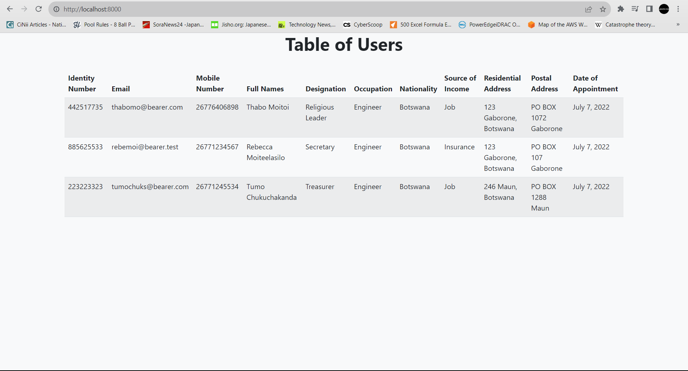
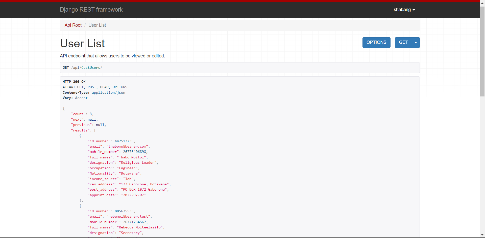

# Interview
Interview task for leverage point with additional RESTful API functionality.

## Main Tasks
The Logic for the requirments can be found in [`populate/management/commands/consume_excel.py`](populate/management/commands/consume_excel.py)

The results retrieved from the database are shown in the image.

## Additional Tasks
A sample of the RESTful API's GET is shown below 

